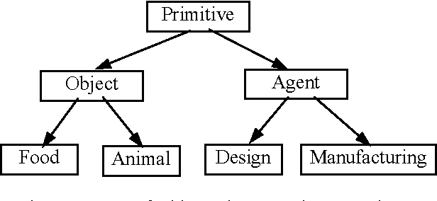
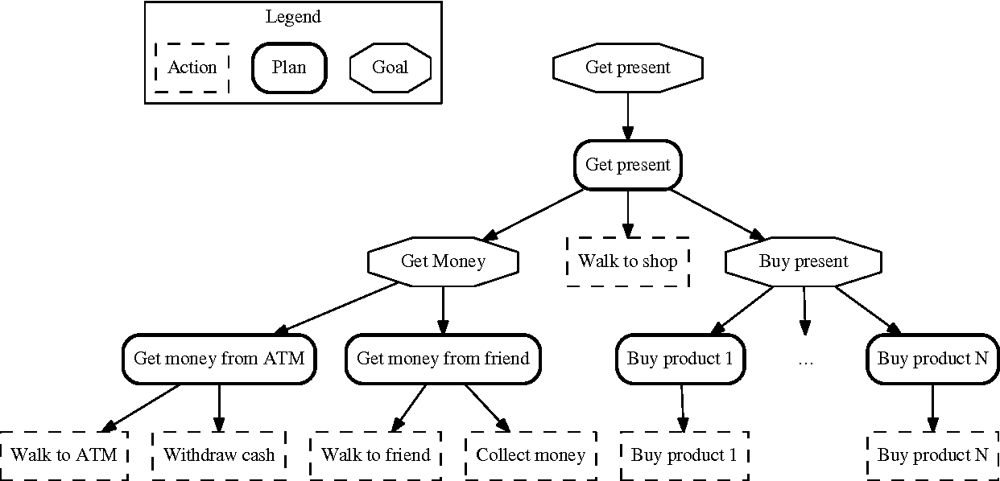

## Agent-oriented programming

Agent-oriented programming (AOP) is a programming paradigm where the construction of the software is centered on the concept of software agents. 
In contrast to object-oriented programming which has objects (providing methods with variable parameters) at its core, 
AOP has externally specified agents (with interfaces and messaging capabilities) at its core. They can be thought of as abstractions of objects. 
Exchanged messages are interpreted by receiving "agents", in a way specific to its class of agents.

<h1 align="center">
   
</h1>

Historically, the concept of agent-oriented programming and the idea of centering software around the concept of an Agent was introduced by Yoav Shoham within his Artificial Intelligence studies in 1990. His agents are specific to his own paradigm as they have just one method, with a single parameter. To quote Yoav Shoham from his paper in 1990 for a basic difference between AOP and OOP

<h1 align="center">
   
</h1>
