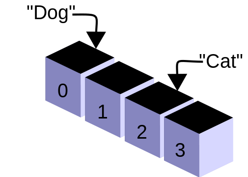

## Array programming

In computer science, array programming refers to solutions which allow the application of operations to an entire set of values at once. Such solutions are commonly used in scientific and engineering settings.

Modern programming languages that support array programming (also known as vector or multidimensional languages) have been engineered specifically to generalize operations on scalars to apply transparently to vectors, matrices, and higher-dimensional arrays. These include APL, J, Fortran 90, MATLAB, Analytica, TK Solver (as lists), Octave, R, Cilk Plus, Julia, Perl Data Language (PDL), and the NumPy extension to Python. In these languages, an operation that operates on entire arrays can be called a vectorized operation,[1] regardless of whether it is executed on a vector processor, which implements vector instructions. Array programming primitives concisely express broad ideas about data manipulation. The level of concision can be dramatic in certain cases: it is not uncommon[example needed] to find array programming language one-liners that require several pages of object-oriented code.

<h1 align="center">
   
</h1>
