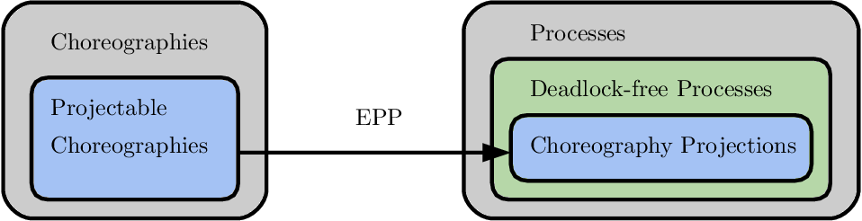

## Choreographic programming

In computer science, choreographic programming is a programming paradigm where programs are compositions of interactions among multiple concurrent participants.

<h1 align="center">
   
</h1>
